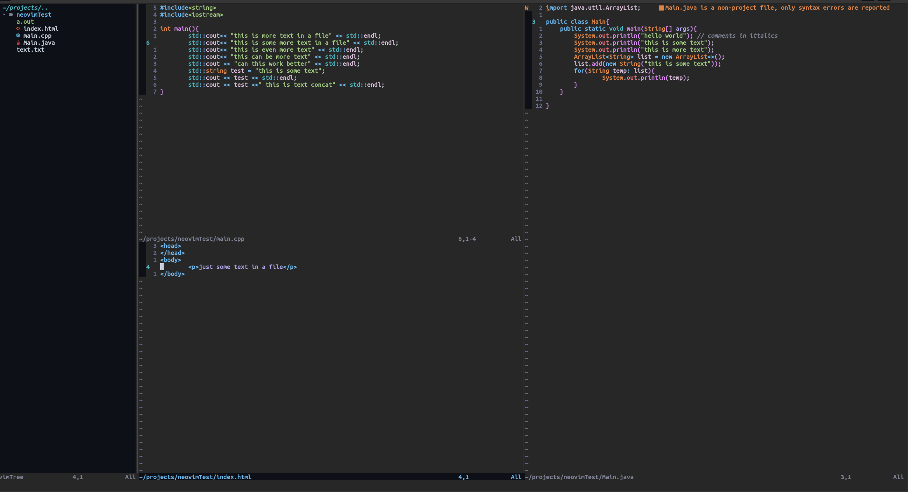

# NVIMCONFIG
My personal NVIM config, uses vimPlug for plugin management 
This will most likely work out of the box without a nerd font, but it is hightly recomend to use a [nerd font](https://www.nerdfonts.com/).
The windows cofig was made to work with windows termnial you may want to download a color scheme to use
Autocomplete is done by [nvim-cmp](https://github.com/hrsh7th/nvim-cmp) and highlighting is done by [treesitter](https://github.com/nvim-treesitter/nvim-treesitter). If you want to use the color scheme for macos you will need to download a terminal that supports 256 color, I recomend Iterm2 or Terminator. 

***PREVIEW LINUX/Iterm2 ONLY (Winows is not shown due to how windows terminal is custmized)*** 

